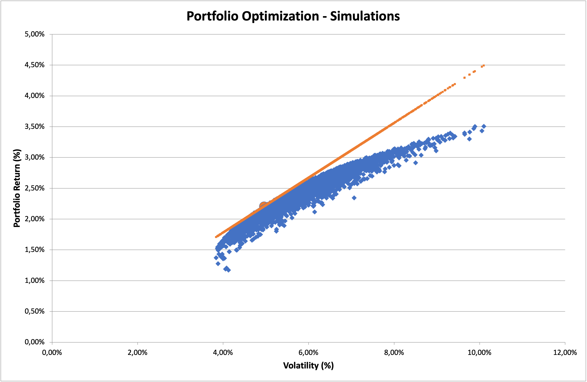

# VBA Project - Portfolio Optimization

## Objectives

This project aims to give to its final user an optimized portfolio. In order to do it, the user is supposed to input the stocks he/she is interested in. The excel file (through an VBA structured code) will extract the historical prices, which are available on Yahoo Finance API (accessed from alphavantage API). 

After have chosen the stocks the user wants to have in his/her portfolio the code will compute, using the Modern portfolio theory the efficient frontier, in which the optmized portfolios are located. The final output will be the portfolio will be the portfolio in the efficient frontier tangent to the capital allocation line (CAL).

\begin{itemize} 

\item The main objective of this project is to construct an Automated Portfolio Optimization Program in which the user can:
\item Choose the number of stocks in the portfolio he wants to build.
\item Import automatically the historical data for each stock with a given ticker (from Yahoo Finance for instance) or using a Power Query request to update the data in real-time.
\item Compute automatically different metrics related to stock performance (returns, volatility, Sharpe Ratio…) and construct the efficient frontier.
\item The code will optimize the portfolio weights to maximize the Sharpe ratio, optimizing the trade-off between returns and volatility.
\item Finally, the user can select the “optimal” portfolio and its relative weights.

## Model test

## Test 1

### Inputs

Risk-free Rate : 0.3% \
Number of iterations : 5000

Start Date : 17/01/2000\
End Date : 17/10/2020

Stocks tickers selected :
* AI.PA (Air Liquide)
* AAPL (Apple)
* MSFT (Microsoft)
* NVDA (Nvidia)
* AMZN (Amazon)
* V (Visa)
* MA (Mastercard)
* WMT (Walmart)

Number of Stocks : 8

### Outputs

#### Optimal weights

* AI.PA weight : 3.78%
* AAPL weight : 19.75%
* MSFT weight : 3.18%
* NVDA weight : 8.62%
* AMZN weight : 16.69%
* V weight : 20.06%
* MA weight : 12.67%
* WMT weight : 15.25%

Sump Check = 100%

#### Optimal portfolio Performance

* Sharpe Ratio : 0.43190822
* Portfolio Average Returns : 2.335%
* Portfolio Standard Deviation : 4.712%

#### Optimization simulations, Optimal Portfolio & Capital Market Line

## Test 2

